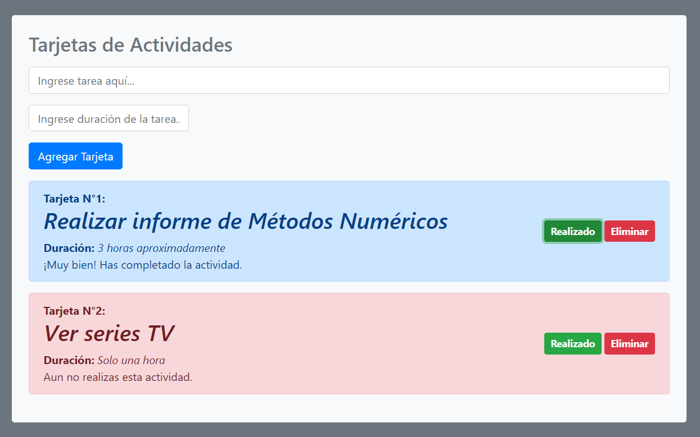

# Tarjetas de Actividades

Mini aplicación para el orden de diversas actividades pequeñas a realizar.

Hecho con JavaScript (Vue)

Instrucciones:

- En el primer cuadro de texto escribir la actividad a realizar (ejemplo: Entregar proyecto).

- En el segundo cuadro de texto escribir la duracíón de la actividad (ejemplo: Tres horas aproximadamente).

- Presionar el botón "Agregar Tarjeta".

- Se desplegará una Tarjeta con el contenido de la actividad.

- Si ha realizado la actividad de la tarjeta, debe presionar el botón "Realizado" para que la Tarjeta cambie de estado 'No realizado' a 'Realizado'.

- Para eliminar una Tarjeta debe presionar el botón "Eliminar".

Disfrute la aplicación.

